# ☁️🤖 AI Cloud Assignment Intelligence Platform

<p align="center">
  <strong>AI-assisted academic workflow automation • Cloud-ready REST APIs • Human-in-the-loop evaluation</strong>
</p>

<p align="center">
  <a href="https://github.com/sujalkrshaw/AI-Cloud-Assignment-Intelligence-Platform/actions/workflows/ci.yml">
    
  </a>
  
  
  
  
  
  
  
</p>

<p align="center">
  <a href="#-project-overview">Overview</a> •
  <a href="#-features">Features</a> •
  <a href="#-architecture">Architecture</a> •
  <a href="#-ai-evaluation-pipeline">AI Pipeline</a> •
  <a href="#-data--analytics">Data & Analytics</a> •
  <a href="#-run-locally-with-docker">Run</a>
</p>

---

## 🎯 Project Overview

**AI Cloud Assignment Intelligence Platform** is an **AI-enabled, cloud-oriented academic workflow platform** that centralizes assignment creation, document submission, automated analysis, rubric-based grading support, teacher review, analytics, governance, and auditability.

The project focuses on a practical engineering problem:

> **How can AI reduce repetitive academic review work while keeping the teacher responsible for the final grading decision?**

Instead of treating AI as a standalone chatbot, the platform integrates AI analysis directly into the assignment lifecycle:

```text
Assignment Creation
        ↓
Student Submission
        ↓
Document Text Extraction
        ↓
AI Analysis
  ├── Similarity
  ├── Relevance
  ├── Rubric Alignment
  ├── Suggested Marks
  └── Feedback Draft
        ↓
Teacher Review / Override
        ↓
Final Grade Publication
        ↓
Analytics + Audit Trail
```

> **Engineering principle:** AI assists the evaluation process; the teacher remains the final decision-maker.

---

# 💡 Why This Project Matters

Academic platforms commonly separate assignment submission, evaluation, feedback, reporting, and administration.

This project brings these capabilities together into one **role-aware, API-driven application** with clear separation of responsibilities across:

- **Presentation Layer:** React + Vite
- **Application Layer:** FastAPI REST backend
- **Persistence Layer:** SQL database models
- **Storage Layer:** file/object storage abstraction
- **AI Layer:** local deterministic document analysis
- **Analytics Layer:** academic + public-data analytics
- **Security Layer:** JWT authentication + RBAC
- **Operations Layer:** Docker + automated tests + CI

The system is therefore suitable as a portfolio demonstration of:

**Software Engineering + Cloud Computing + AI/NLP + Backend Development + Frontend Development + Database Design + API Development + Authentication + Authorization + Data Analytics + DevOps + Testing.**

---

# ✨ Features

## 🔐 Authentication & Security

- JWT-based authentication
- bcrypt password hashing
- Protected REST APIs
- Role-based access control (**RBAC**)
- Student / Teacher / Admin authorization boundaries
- `401 Unauthorized` vs `403 Forbidden` handling
- Environment-based configuration
- Git-safe secret handling through `.gitignore`

### 🔒 RBAC Validation

```text
Student JWT
    │
    └──→ GET /api/admin/users
                  │
                  └──→ 403 Forbidden ❌

Admin JWT
    │
    └──→ GET /api/admin/users
                  │
                  └──→ 200 OK ✅
```

---

# 👥 Role-Based Workspaces

| Role | Responsibilities |
|---|---|
| 👨‍🎓 **Student** | View assignments, submit work, track submissions, view published results and performance |
| 👨‍🏫 **Teacher** | Create assignments, define rubrics, review submissions, run AI analysis, edit marks/feedback, publish grades |
| 👑 **Admin** | User governance, courses/batches, audit logs, enterprise analytics, AI settings, system controls |

---

# 🤖 AI Evaluation Pipeline

The default AI engine runs **locally** and does not require an external LLM API key.

## 🧠 Processing Flow

```text
Assignment Prompt + Rubric
              +
      Student Submission
              ↓
      Document Extraction
              ↓
      TF-IDF Vectorization
              ↓
       Cosine Similarity
              ↓
       Relevance Analysis
              ↓
      Rubric-Aware Scoring
              ↓
   ┌──────────┼───────────┐
   ↓          ↓           ↓
Suggested   Criterion   Feedback
  Marks      Matrix       Draft
   └──────────┼───────────┘
              ↓
       Teacher Review
              ↓
      Final Grade / Feedback
```

## AI Outputs

- 📄 Extracted document text
- 🔢 Word count
- 📐 Similarity score
- 🎯 Relevance score
- 🧮 Suggested marks
- 📋 Criterion-level rubric matrix
- 💬 Feedback draft
- ✍️ Teacher-editable final grade

## Example Rubric

```text
Technical Accuracy       40%
Cloud Architecture       25%
Security                  20%
Clarity & Completeness    15%
```

## Human-in-the-Loop Design

```text
AI recommendation
      ↓
Teacher verifies evidence
      ↓
Teacher edits marks / feedback
      ↓
Approve & publish
```

The platform does **not** present the AI recommendation as an unquestionable final grade.

---

# 📝 Assignment & Submission Workflow

## 👨‍🏫 Teacher Workflow

```text
Create Assignment
      ↓
Set Prompt / Deadline / Max Marks
      ↓
Define Rubric
      ↓
Receive Submission
      ↓
Run AI Review
      ↓
Review AI Recommendation
      ↓
Edit / Override
      ↓
Publish Final Grade
```

Teacher capabilities include:

- Create assignments
- Define assignment descriptions
- Configure maximum marks
- Define evaluation rubrics
- Set deadlines
- Configure allowed file extensions
- Review incoming submissions
- Run AI analysis
- Review suggested marks
- Edit final marks
- Edit feedback
- Publish grades

---

## 👨‍🎓 Student Workflow

```text
Open Assignment
      ↓
Upload Document
      ↓
Submit
      ↓
Track Status
      ↓
View Published Grade + Feedback
```

Student capabilities include:

- View available assignments
- Open assignment details
- Upload supported documents
- Submit work
- Track submission history
- View grading status
- View published results

### 📎 Supported Submission Formats

- PDF
- DOCX
- TXT

---

# 📊 Data & Analytics

The analytics layer distinguishes between:

1. **Platform/demo data**
2. **External public/research data**

This separation helps keep data provenance clear and avoids presenting demo values as external facts.

---

## 🎓 UCI Student Performance Dataset

The project integrates the **UCI Student Performance** dataset.

**Dataset ID:** `320`

Current loaded subsets:

| Dataset | Records | Current dashboard metric |
|---|---:|---:|
| Mathematics | **395** | Average G3: **10.42 / 20** |
| Portuguese | **649** | Average G3: **11.91 / 20** |

### Source

[UCI Machine Learning Repository — Student Performance](https://archive.ics.uci.edu/dataset/320/student%2Bperformance)

The dataset contains student performance information from two Portuguese schools, including academic, demographic, social, school-related, absence, and grade attributes.

---

# 🇬🇧 UK Department for Education — Pupil Attendance

The platform also integrates the weekly:

**UK Department for Education — Pupil Attendance in Schools**

Current loaded dataset state:

```text
Records / observations: 647
Attendance aggregate:   93.91%
Absence aggregate:       6.09%
```

### Official Source

[Explore Education Statistics — Pupil Attendance in Schools](https://explore-education-statistics.service.gov.uk/find-statistics/pupil-attendance-in-schools/2026-week-37-start-of-26-27-ay)

### Dataset Catalogue

[DfE Dataset Catalogue](https://explore-education-statistics.service.gov.uk/data-catalogue/data-set/c0be1b5f-4240-4f99-ba80-70be8916c5ef)

> **Interpretation note:** the percentages above are the application's aggregate calculation over the loaded rows. They should not be presented as a single national DfE headline figure without applying the appropriate geographic and education-phase filtering.

---

# 🏗️ Architecture

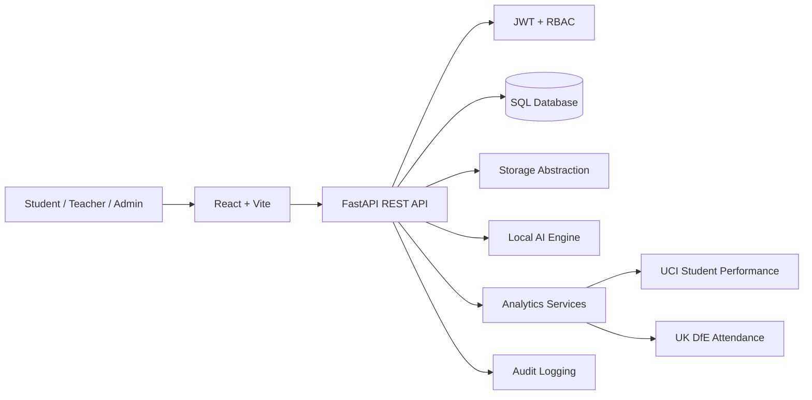

---

# 🧱 Architectural Layers

| Layer | Technology / Responsibility |
|---|---|
| 🎨 **Frontend** | React, Vite, responsive UI, REST integration |
| ⚡ **API** | FastAPI, route modules, validation, authorization |
| 🔐 **Security** | JWT, bcrypt, RBAC, protected resources |
| 🗄️ **Database** | SQLAlchemy models + SQL persistence |
| ☁️ **Storage** | File/object-storage abstraction for document uploads |
| 🤖 **AI** | TF-IDF, cosine similarity, relevance, rubric-aware scoring |
| 📊 **Analytics** | Academic + public-data metrics and reporting |
| 🧾 **Audit** | Activity and administrative logging |
| 🐳 **Operations** | Docker Compose, CI workflow, automated tests |

---

# ☁️ Cloud Computing Concepts Demonstrated

This project demonstrates practical **cloud-oriented software engineering** patterns:

- RESTful API architecture
- Frontend/backend separation
- Stateless token-based authentication
- Role-based authorization
- SQL persistence
- File/object storage abstraction
- Containerized services
- Environment-based configuration
- API-driven analytics
- Dataset ingestion
- Audit logging
- CI automation
- Modular backend services
- Architecture suitable for migration to managed cloud infrastructure

## Cloud-Ready Evolution

```text
Current Local / Development Deployment
                ↓
       Containerized Services
                ↓
        Managed SQL Database
                ↓
        Cloud Object Storage
                ↓
     Background Job / Queue Layer
                ↓
      Observability + Autoscaling
```

The repository demonstrates the **foundation** for this progression rather than claiming those production services are already deployed.

---

# 🧰 Technology Stack

## 🎨 Frontend


- React
- Vite
- JavaScript
- CSS
- Fetch API
- REST API integration

---

## ⚡ Backend


- Python
- FastAPI
- Pydantic
- SQLAlchemy
- JWT authentication
- bcrypt password hashing
- REST API development
- Document processing

---

## 🤖 AI / NLP


- TF-IDF vectorization
- Cosine similarity
- Relevance scoring
- Rubric-aware deterministic evaluation
- Document text extraction
- Automated feedback generation

---

## 🐳 DevOps / Cloud


- Docker
- Docker Compose
- GitHub Actions
- CI workflows
- Environment-based configuration
- Containerized application development

---

# 📂 Repository Structure

```text
AI-Cloud-Assignment-Intelligence-Platform/
│
├── .github/
│   └── workflows/
│       └── ci.yml
│
├── backend/
│   ├── ai/
│   │   ├── document.py
│   │   └── engine.py
│   │
│   ├── cloud/
│   │   └── storage.py
│   │
│   ├── core/
│   │   ├── audit.py
│   │   ├── deps.py
│   │   └── security.py
│   │
│   ├── routers/
│   │   ├── admin.py
│   │   ├── admin_reports.py
│   │   ├── ai.py
│   │   ├── analytics.py
│   │   ├── assignments.py
│   │   ├── auth.py
│   │   ├── courses.py
│   │   ├── dashboard.py
│   │   ├── enterprise_analytics.py
│   │   ├── grading.py
│   │   ├── resubmissions.py
│   │   ├── submissions.py
│   │   └── system.py
│   │
│   ├── tests/
│   │   ├── test_ai.py
│   │   ├── test_auth.py
│   │   ├── test_health.py
│   │   ├── test_public_data.py
│   │   └── test_workflow.py
│   │
│   ├── database.py
│   ├── models.py
│   ├── schemas.py
│   └── seed.py
│
├── data/
│   ├── academic_demo_data.csv
│   ├── sample_assignments.json
│   └── real/
│       └── README.md
│
├── docs/
│   ├── api.md
│   ├── architecture.md
│   ├── deployment.md
│   └── ui.md
│
├── frontend/
│   ├── src/
│   │   ├── main.jsx
│   │   └── style.css
│   ├── index.html
│   ├── package.json
│   └── vite.config.js
│
├── sample_files/
├── screenshots/
├── scripts/
│   ├── download_dfe_pupil_attendance.py
│   └── download_uci_student_performance.py
│
├── .dockerignore
├── .env.example
├── .gitignore
├── Dockerfile
├── FEATURE_AUDIT.md
├── VALIDATION.md
├── docker-compose.yml
├── install.ps1
├── project_inventory.txt
└── README.md
```

---

# 🐳 Run Locally with Docker

## Requirements

- Docker Desktop
- Docker Compose
- Git
- Windows 10/11, macOS, or Linux

---

## 1️⃣ Clone the Repository

```bash
git clone https://github.com/sujalkrshaw/AI-Cloud-Assignment-Intelligence-Platform.git
cd AI-Cloud-Assignment-Intelligence-Platform
```

---

## 2️⃣ Create Local Environment Configuration

### Windows PowerShell

```powershell
Copy-Item .env.example .env
```

### Linux / macOS

```bash
cp .env.example .env
```

Review `.env` before using the application outside a local/demo environment.

---

## 3️⃣ Build and Start

```bash
docker compose up -d --build
```

---

## 4️⃣ Check Running Services

```bash
docker compose ps
```

Default development URLs:

```text
Frontend → http://localhost:5173
Backend  → http://localhost:8000
Health   → http://localhost:8000/health
```

Expected health response:

```json
{
  "status": "ok",
  "service": "assignment-intelligence-api"
}
```

---

## 5️⃣ Stop the Application

```bash
docker compose down
```

---

# 🔑 Demo Accounts

> ⚠️ These are **disposable demonstration accounts only**. Do not reuse them in production.

| Role | Email | Password |
|---|---|---|
| 👑 Admin | `admin@demo.edu` | `Admin@123` |
| 👨‍🏫 Teacher | `teacher@demo.edu` | `Teacher@123` |
| 👨‍🎓 Student | `student1@demo.edu` | `Student@123` |
| 👨‍🎓 Student 2 | `student2@demo.edu` | `Student@123` |

---

# 🔌 REST API Surface

The backend is organized around modular REST API route groups.

| API Area | Example Route |
|---|---|
| 🔐 Authentication | `/api/auth/login` |
| 📝 Assignments | `/api/assignments` |
| 📤 Submissions | `/api/submissions/...` |
| 🤖 AI Analysis | `/api/ai/...` |
| 🎓 Grading | `/api/grading/...` |
| 👑 Administration | `/api/admin/...` |
| 📊 Dataset Analytics | `/api/analytics/...` |
| 📈 Enterprise Analytics | `/api/enterprise-analytics/...` |
| 🖥️ System Status | `/api/system/status` |
| ❤️ Health Check | `/health` |

Detailed API documentation:

[`docs/api.md`](docs/api.md)

---

# 🔒 Security Model

The platform separates **authentication** from **authorization**.

```text
Authentication
      ↓
Who are you?
      ↓
JWT Token
      ↓
Authorization
      ↓
What are you allowed to do?
      ↓
Role-Based Permission Checks
```

### Example

A valid student token is denied access to an admin-only endpoint:

```text
GET /api/admin/users
        ↓
Student JWT
        ↓
403 Forbidden
```

An administrator with the appropriate role can access the same protected endpoint.

---

# 🧪 Testing & Validation

The repository includes automated backend tests covering:

- Authentication
- Health checks
- AI analysis
- Public-data handling
- Assignment/submission workflow

### ✅ Validated Local Result

```text
8 passed
21 warnings
```

Run the test suite:

```bash
docker compose exec backend pytest -q
```

The observed warnings were non-failing dependency/deprecation warnings.

Additional validation documentation:

- [`VALIDATION.md`](VALIDATION.md)
- [`FEATURE_AUDIT.md`](FEATURE_AUDIT.md)

---

# 📸 Project Screenshots

## 🔐 Login / Authentication

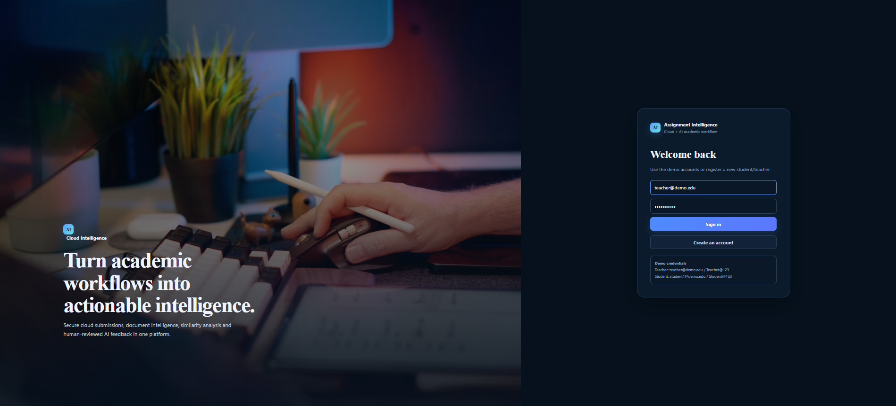

---

## 👨‍🎓 Student Dashboard

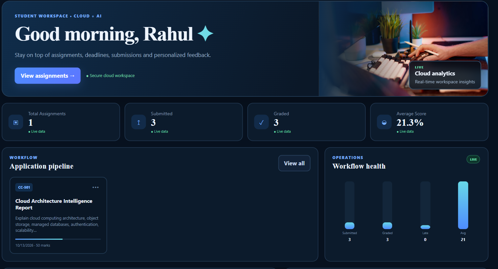

---

## 👨‍🏫 Teacher Dashboard

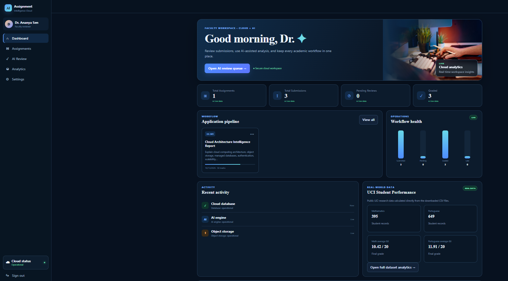

---

## 📝 Assignment

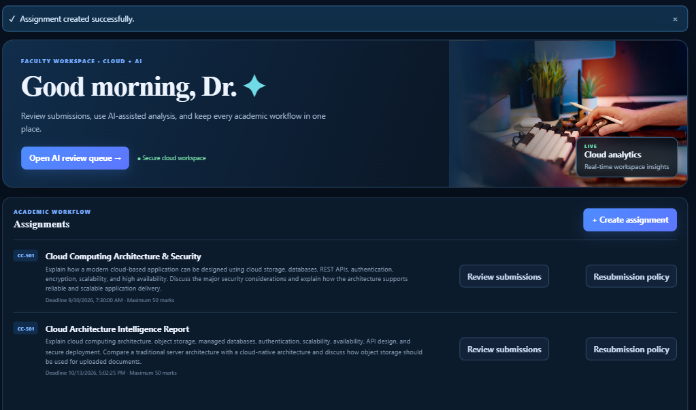

---

## 📤 Student Submission

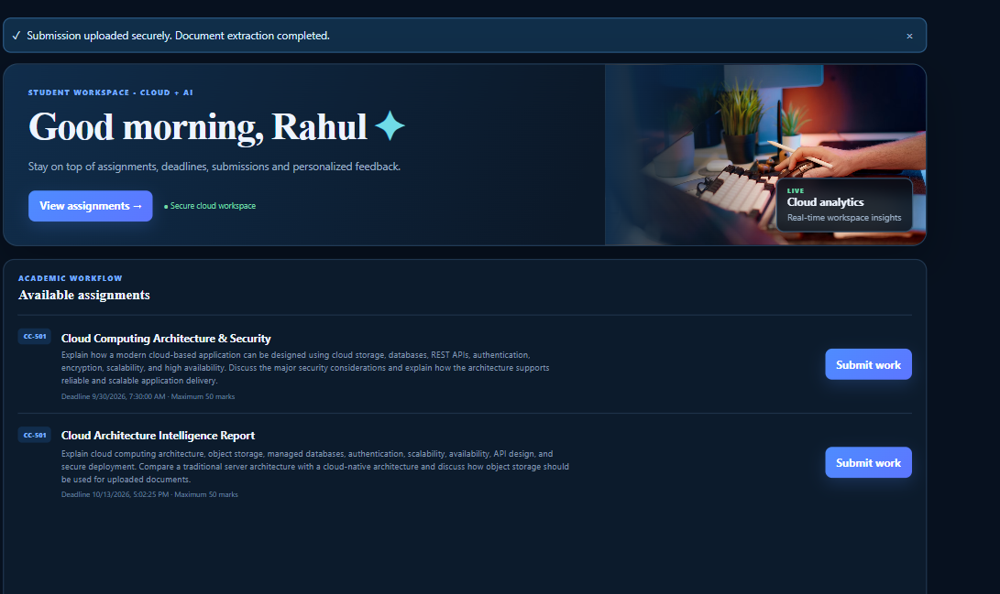

---

## 🤖 AI Analysis

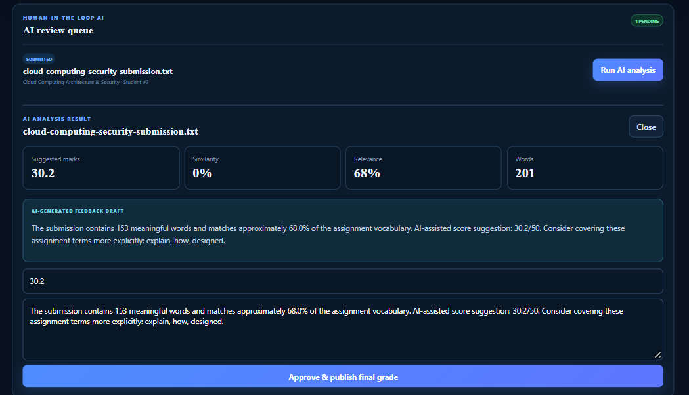

---

## 🔒 RBAC — Student Forbidden

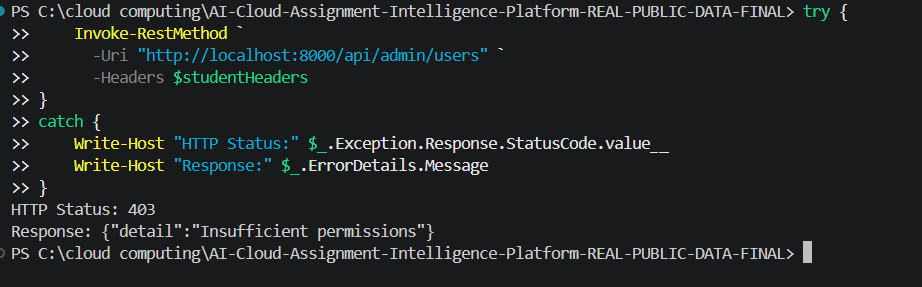

---

## 👑 RBAC — Admin Access

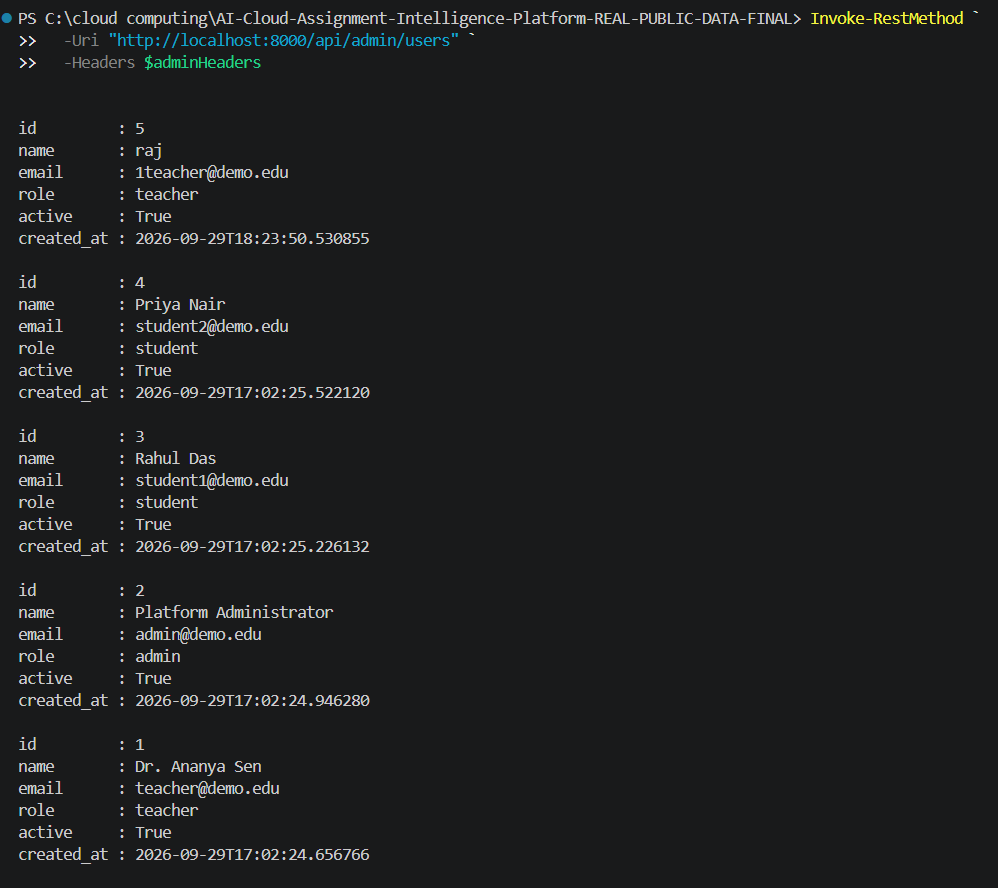

---

## 🐳 Docker Services

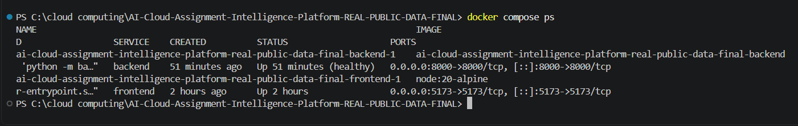

---

## 🧪 Automated Test Suite

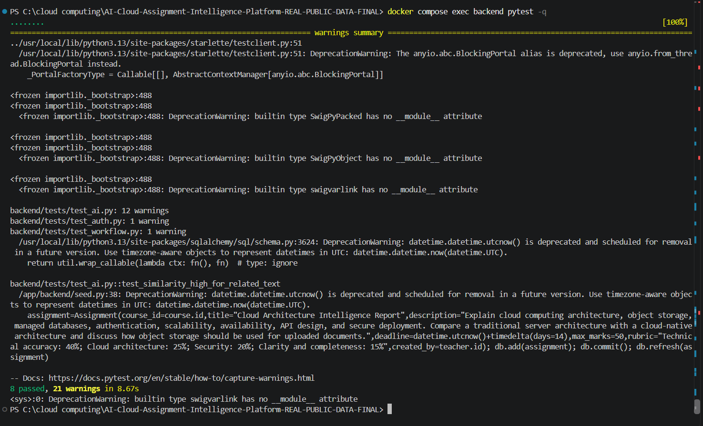

---

## 📊 Official Public Data

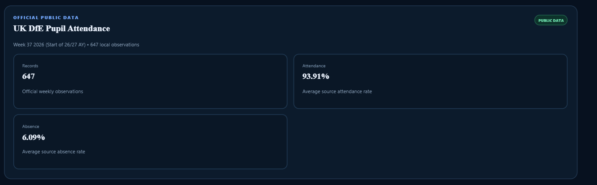

---

## 🎓 UCI Dataset Analytics

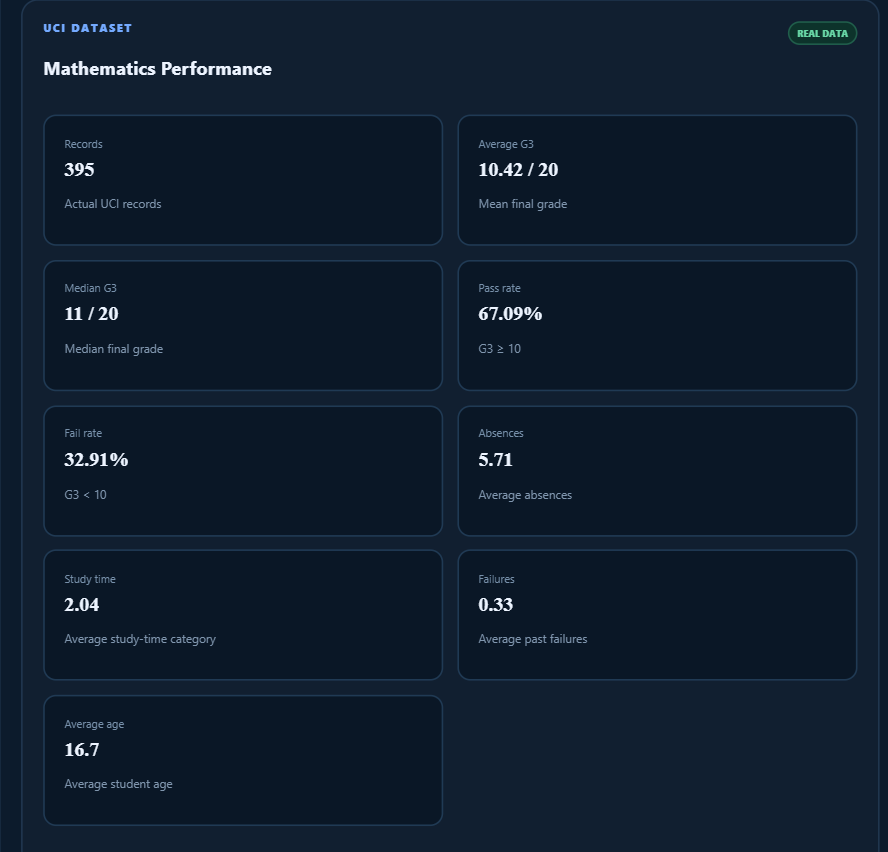

---

# 📚 Engineering Documentation

The repository includes additional engineering documentation:

- [`docs/api.md`](docs/api.md) — REST API reference
- [`docs/architecture.md`](docs/architecture.md) — architecture and component design
- [`docs/deployment.md`](docs/deployment.md) — deployment guidance
- [`docs/ui.md`](docs/ui.md) — user-interface documentation
- [`FEATURE_AUDIT.md`](FEATURE_AUDIT.md) — feature implementation audit
- [`VALIDATION.md`](VALIDATION.md) — validation evidence

---

# 🔎 Recruiter / ATS Skill Keywords

```text
Artificial Intelligence, AI, Machine Learning, NLP, Natural Language Processing,
TF-IDF, Cosine Similarity, Document Intelligence, Text Analysis,
Automated Evaluation, Rubric-Based Scoring, Human-in-the-Loop AI,
Cloud Computing, Cloud Architecture, SaaS, Software as a Service,
REST API, RESTful APIs, FastAPI, Python, React, Vite, JavaScript,
SQL, SQLAlchemy, JWT, JSON Web Tokens, RBAC, Role-Based Access Control,
Authentication, Authorization, bcrypt, API Security, File Upload,
Document Processing, PDF Processing, DOCX Processing, TXT Processing,
Data Analytics, Public Datasets, UCI Machine Learning Repository,
UK Department for Education, Docker, Docker Compose, GitHub Actions,
Continuous Integration, CI, Automated Testing, Backend Development,
Frontend Development, Database Design, Audit Logging, System Architecture,
Cloud-Ready Architecture, DevOps, API Development, Web Application
```

---

# 🎯 What This Project Demonstrates

This project demonstrates practical engineering across multiple layers of an application:

```text
Requirements
      ↓
System Design
      ↓
Frontend Development
      ↓
REST API Development
      ↓
Database + Storage
      ↓
AI / NLP Pipeline
      ↓
Authentication + RBAC
      ↓
Analytics
      ↓
Docker / CI
      ↓
Testing + Validation
      ↓
Technical Documentation
```

The core engineering value is the integration of:

**AI + Cloud Computing + Software Engineering + API Development + Security + Data Analytics + DevOps**

into one working system.

---

# 🧠 Engineering Highlights

### AI / NLP

- Local TF-IDF document vectorization
- Cosine similarity
- Relevance analysis
- Rubric-aware scoring
- Suggested marks
- Feedback generation
- Teacher validation and override

### Backend

- FastAPI REST API
- Modular route architecture
- SQLAlchemy models
- Request validation
- Authentication dependencies
- Role-based authorization
- Audit logging

### Frontend

- React-based application
- Vite development environment
- Role-specific workspaces
- Assignment workflow
- AI review workflow
- Analytics dashboard
- Admin controls

### Security

- JWT authentication
- bcrypt password hashing
- Protected API endpoints
- RBAC enforcement
- Unauthorized / forbidden handling
- Environment configuration
- Git-safe secret management

### Cloud / DevOps

- Docker containerization
- Docker Compose orchestration
- Separate frontend/backend services
- CI workflow with GitHub Actions
- Cloud-ready storage abstraction
- Environment-driven configuration

### Data Engineering

- UCI public dataset integration
- UK DfE public dataset integration
- Dataset acquisition scripts
- CSV parsing
- Dataset metric calculation
- Data provenance tracking

---

# 🔭 Future Improvements

The following are intentionally listed as **future work**, not as currently completed production capabilities:

- Managed PostgreSQL deployment
- Cloud object storage such as S3-compatible storage
- Background job queues for large-scale document analysis
- Notification services
- Advanced document parsing
- Optional pluggable LLM feedback providers
- Centralized observability
- Production secret management
- Horizontal scaling
- Container orchestration
- Advanced monitoring and alerting

---

# ⚠️ Scope & Limitations

This project is an **industry-oriented educational / portfolio implementation** and should not be treated as a production-certified academic grading service.

Important limitations:

- The default AI engine is deterministic and local.
- AI recommendations are designed to support teacher review.
- Demo accounts use intentionally simple disposable credentials.
- The default Docker configuration is designed for development/demo use.
- Public-data analytics depend on the currently downloaded dataset release and aggregation logic.
- Production deployment would require hardened infrastructure, managed secrets, managed databases, object storage, monitoring, backups, privacy controls, and stronger operational security.

---

# 🗃️ Data Provenance & Attribution

## UCI Student Performance

**Source:** UCI Machine Learning Repository

**Dataset:** Student Performance

**Dataset ID:** `320`

**DOI:**  
https://doi.org/10.24432/C5TG7T

The project uses the Mathematics and Portuguese student performance datasets.

---

## UK Department for Education

**Source:** UK Department for Education / Explore Education Statistics

**Dataset:** Pupil Attendance in Schools — weekly release

Official source:

https://explore-education-statistics.service.gov.uk/find-statistics/pupil-attendance-in-schools/2026-week-37-start-of-26-27-ay

Dataset catalogue:

https://explore-education-statistics.service.gov.uk/data-catalogue/data-set/c0be1b5f-4240-4f99-ba80-70be8916c5ef

Review applicable licensing and attribution requirements before redistributing external datasets or derived materials.

---

# 🔐 Repository Security Notes

The project intentionally keeps development secrets outside Git.

The repository uses:

```text
.env
```

for local configuration and:

```text
.env.example
```

for safe configuration examples.

The `.gitignore` excludes:

```text
.venv/
__pycache__/
*.pyc
*.db
.env
storage/
node_modules/
dist/
*.log
.DS_Store
```

Never place production credentials, API keys, JWT secrets, cloud credentials, or private tokens directly into source control.

---

# 🏆 Project Positioning

This repository is designed to demonstrate practical capability in:

```text
AI Engineering
Cloud Computing
Software Engineering
Backend Development
Frontend Development
REST API Development
Database Engineering
Document Intelligence
NLP
Authentication
Authorization
RBAC
Data Analytics
DevOps
Docker
Continuous Integration
Automated Testing
Technical Documentation
```

Rather than presenting isolated technology demos, the project demonstrates how these technologies can be integrated into a complete application workflow.

---

# 📌 Repository

**GitHub:**  
https://github.com/sujalkrshaw/AI-Cloud-Assignment-Intelligence-Platform

---

<p align="center">
  ⭐ Built as a practical demonstration of <strong>AI + Cloud + Software Engineering</strong>.<br>
  🔐 Secure by design • 🤖 AI-assisted • ☁️ Cloud-oriented • 🧪 Tested • 📊 Data-driven
</p>
